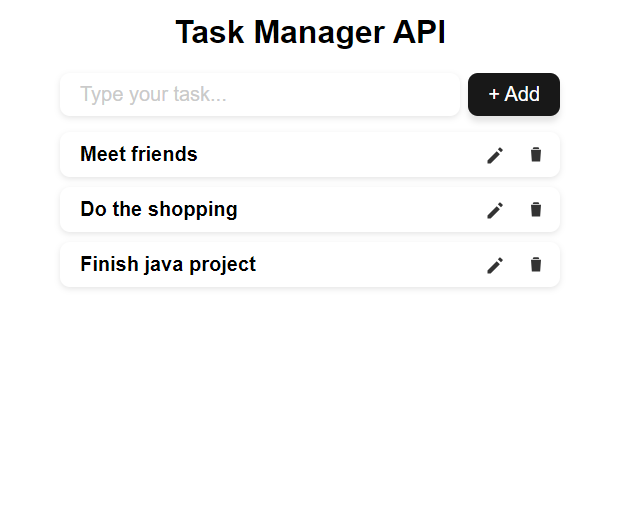
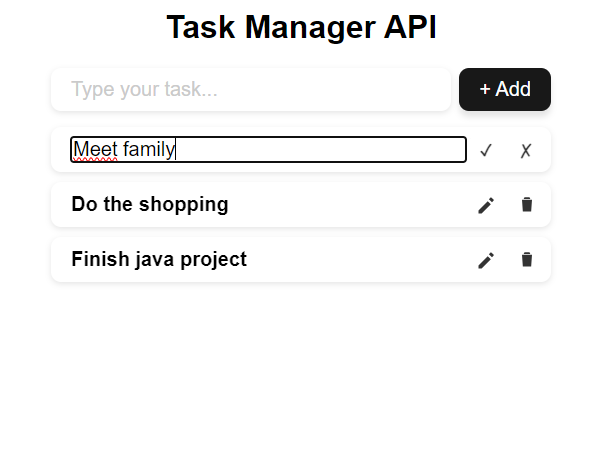

# Task Manager API

A simple full-stack task manager application built with Spring Boot (backend) and React (frontend).  
  
The app allows users to create, edit, delete, and mark tasks as completed, with real-time UI updates via a REST API.






## Main features

-   Add new tasks
-   Edit existing tasks
-   Delete tasks
-   Mark tasks as done / undone

## Tech Stack

 Frontend:
-   React
-   JavaScript (ES6+)
-   Fetch API
-   CSS

Backend:
-   Java
-   Spring Boot
-   Spring Web
-   REST API

## Run instruction

```
git clone https://github.com/mborula/task-manager-api.git
cd task-manager-api
```

Spring server:
```
cd backend
mvnw spring-boot:run

Backend runs on: http://localhost:8080
Frontend communicates with backend via: http://localhost:8080/tasks
```
React frontend:
```
cd frontend  
npm install  
npm run dev

Frontend runs on: http://localhost:5173
```
