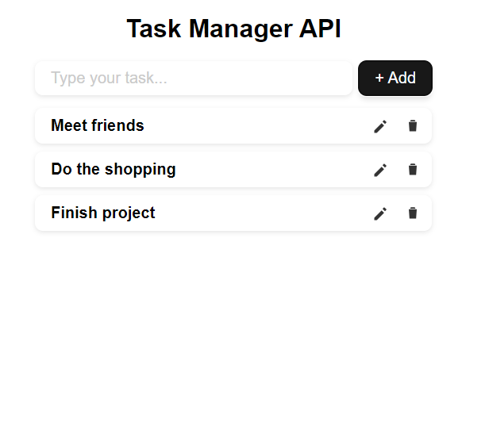
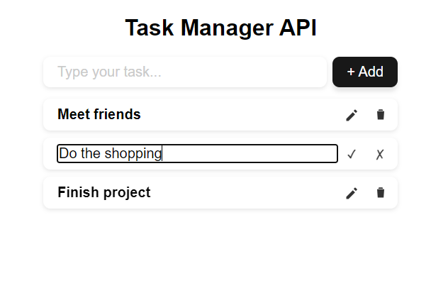

# task-manager-api
Task manager application 

A full-stack TODO application built with React and Spring Boot.
It allows users to create, update, delete, and manage tasks through a simple and responsive interface.

Work in progres
